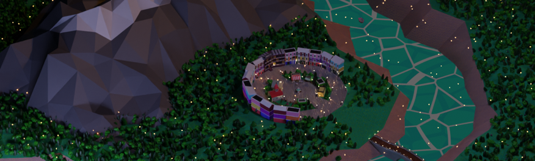

# Squareton-Blender

This is a group project I did for the subject Graphic Modeling and Visualization, it consisted on using Blender to create an animation.
I am going to display here only the models I had worked on. 

## Models
- Church
- Bar (Partially)
- City Square
- Fountain
- Street Lamps
- Benches
- Garbage Cans
- Supermarket
- Pharmacy
- Florist (Partially)
- Park
  - Slide
  - Swing
  - Fence
- Outer Ring of Buildings (Partially)
- Terrain
- Mountain
- Stratum
- Vegetation (Partially)
- Waterfall Rocks
- Bridge
- Lighthouse
- Starry Sky
- Fireflies
- Barrels
- Windmills
- Character (Partially)

